# 课程管理系统 交互设计文档

**版本：** v1.0
**日期：** 2026-03-25
**系统访问地址：** http://34.173.18.26

---

## 目录

1. [系统角色与权限](#一系统角色与权限)
2. [整体流程概览](#二整体流程概览)
3. [用户注册与登录](#三用户注册与登录)
4. [教师端交互流程](#四教师端交互流程)
5. [学生端交互流程](#五学生端交互流程)
6. [核心业务状态机](#六核心业务状态机)
7. [页面布局说明](#七页面布局说明)
8. [错误处理交互](#八错误处理交互)

---

## 一、系统角色与权限

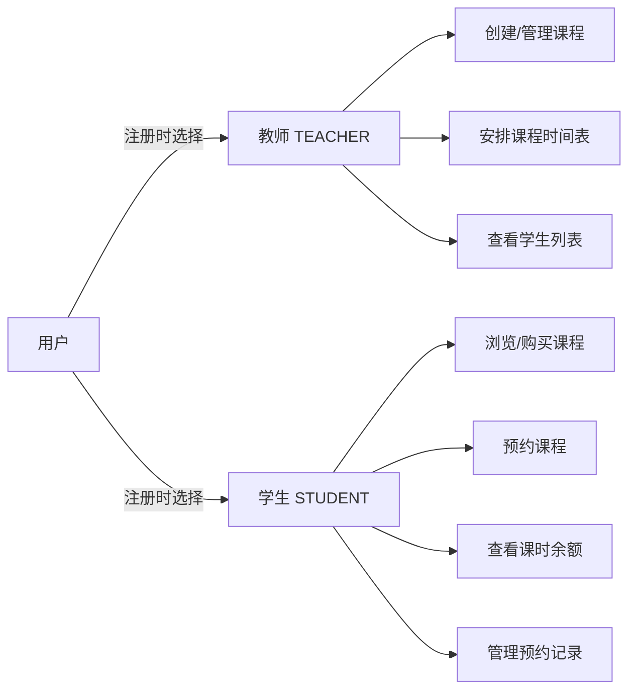

| 角色 | 可访问路由 | 核心权限 |
|------|-----------|----------|
| 教师 | `/teacher/*` | 课程CRUD、排课管理 |
| 学生 | `/student/*` | 购课、预约、查余额 |
| 未登录 | `/login` `/register` | 注册登录 |

---

## 二、整体流程概览

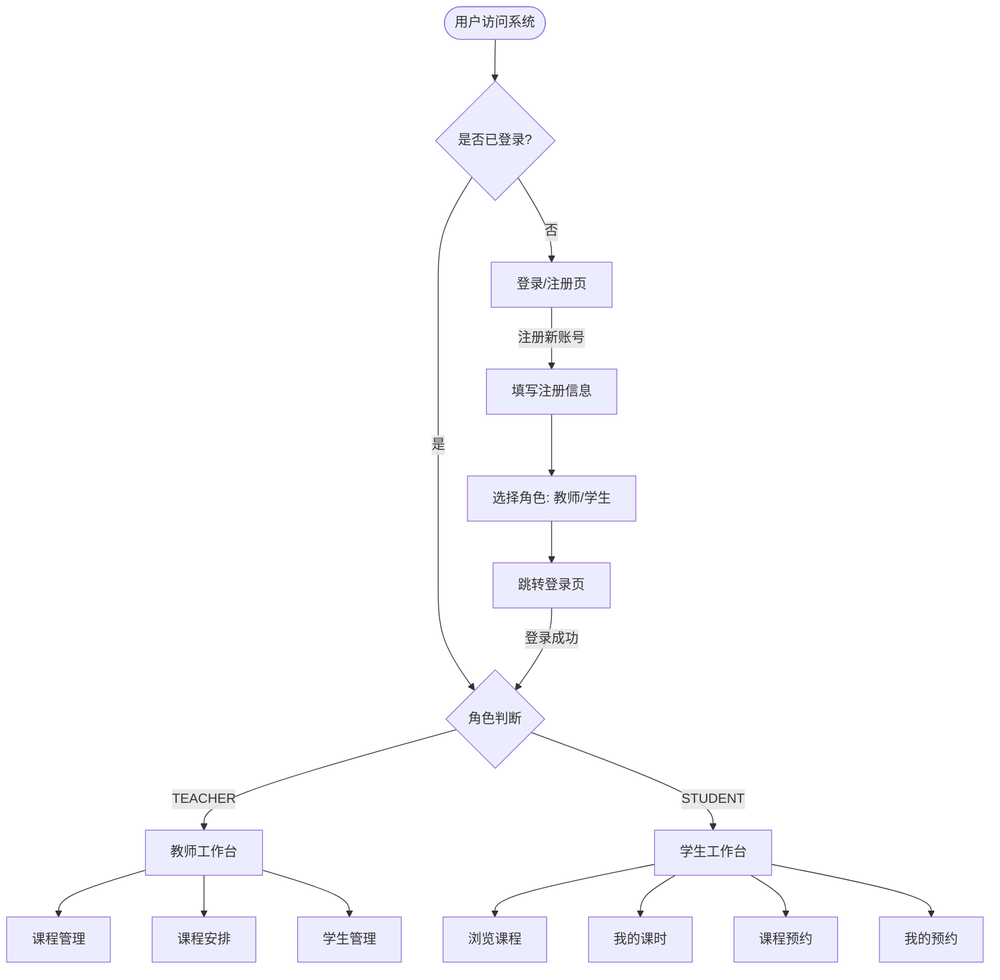

---

## 三、用户注册与登录

### 3.1 注册流程

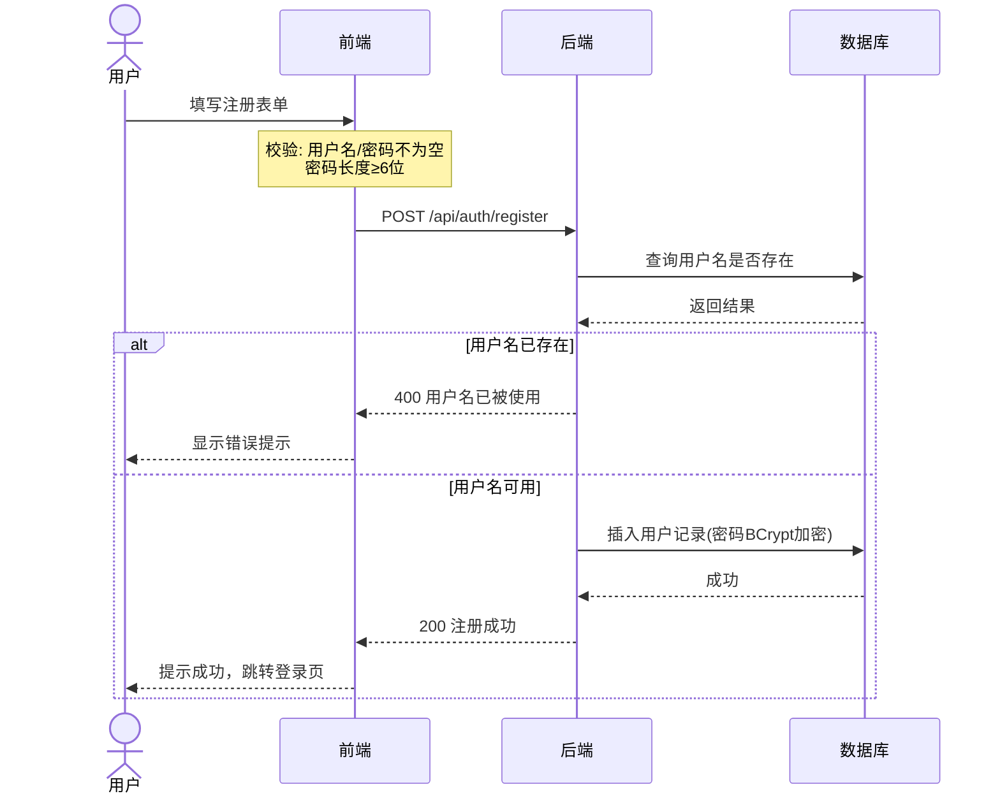

### 3.2 登录流程

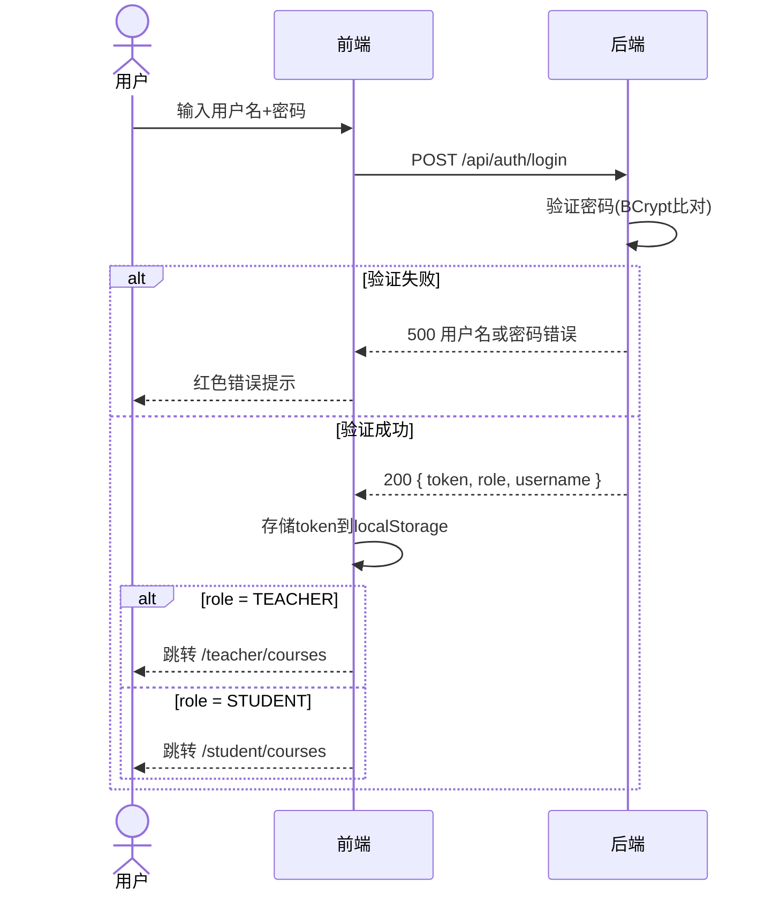

### 3.3 注册页面字段说明

| 字段 | 类型 | 必填 | 校验规则 |
|------|------|------|----------|
| 用户名 | 文本输入 | ✅ | 不为空，唯一 |
| 密码 | 密码输入 | ✅ | 不为空 |
| 角色 | 单选（教师/学生） | ✅ | 必选其一 |
| 真实姓名 | 文本输入 | ❌ | — |
| 邮箱 | 邮箱输入 | ❌ | 格式校验 |

---

## 四、教师端交互流程

### 4.1 课程管理

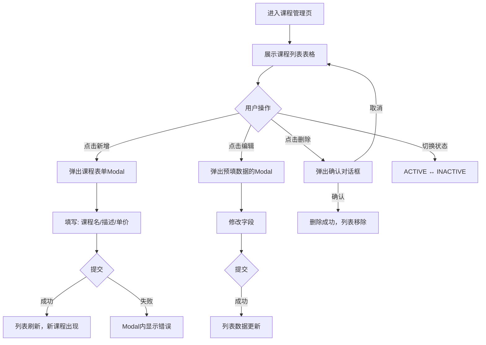

**课程表单字段：**

| 字段 | 组件 | 说明 |
|------|------|------|
| 课程名称 | Input | 必填 |
| 课程描述 | TextArea | 选填 |
| 每课时单价（元） | InputNumber | 必填，≥0 |
| 状态 | Switch | 默认启用 |

### 4.2 课程安排

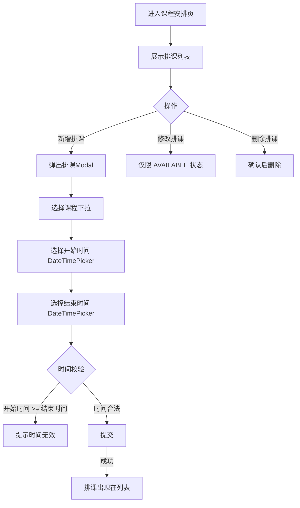

**排课状态说明：**

| 状态 | 含义 | 可操作 |
|------|------|--------|
| AVAILABLE | 可被学生预约 | 可编辑/删除 |
| BOOKED | 已被学生预约 | 只读 |
| COMPLETED | 已完成 | 只读 |
| CANCELLED | 已取消 | 只读 |

### 4.3 学生管理

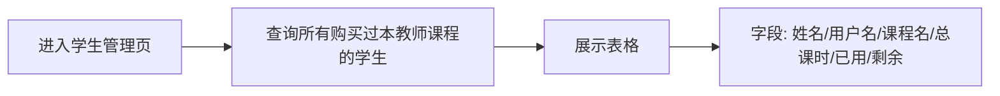

---

## 五、学生端交互流程

### 5.1 购买课时（核心流程）

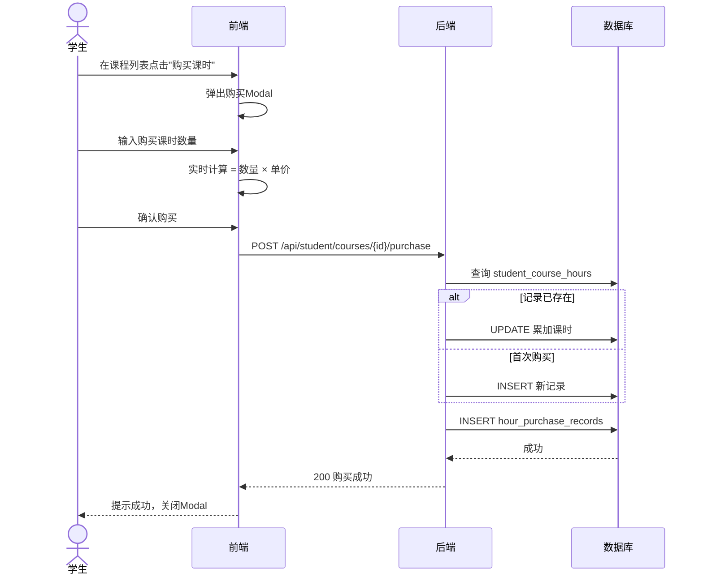

### 5.2 预约课程（核心流程）

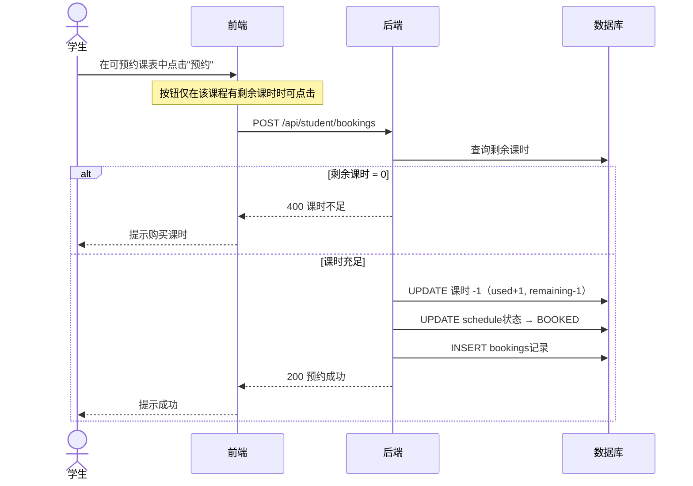

### 5.3 取消预约（退还课时）

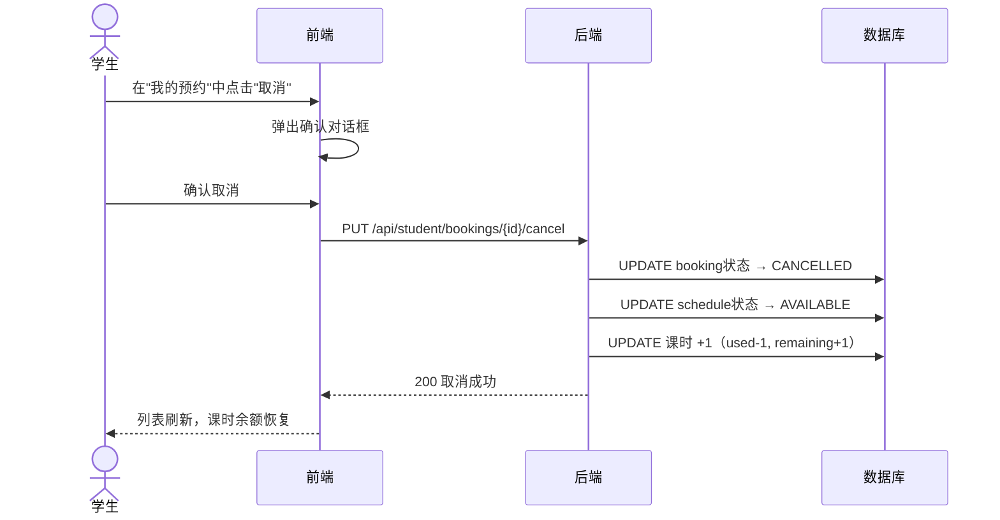

### 5.4 我的课时页面

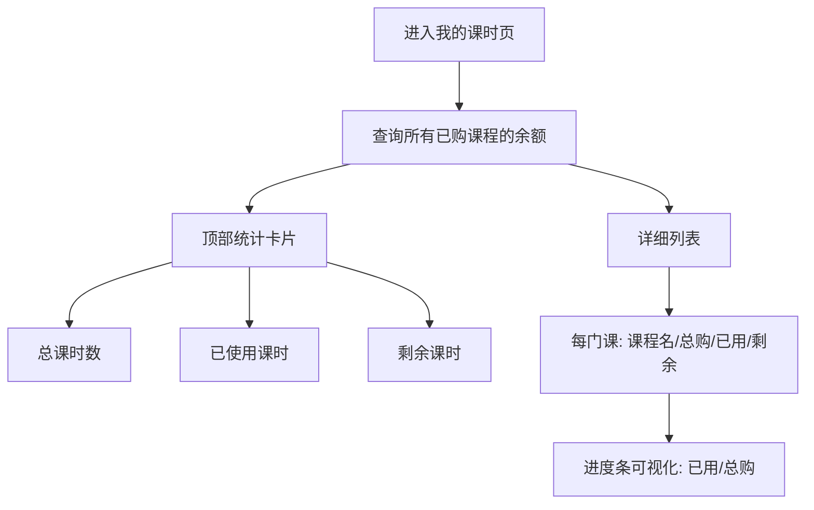

---

## 六、核心业务状态机

### 6.1 课程状态

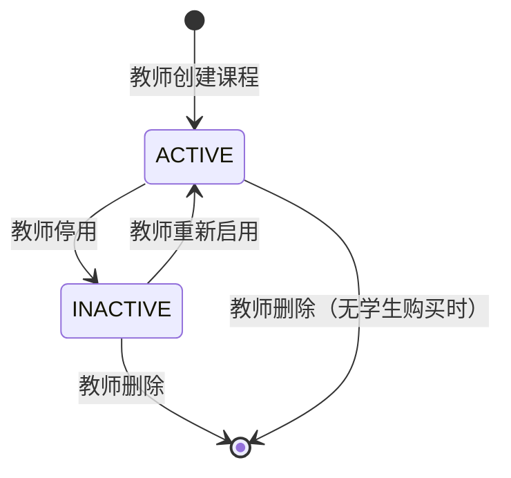

### 6.2 排课状态

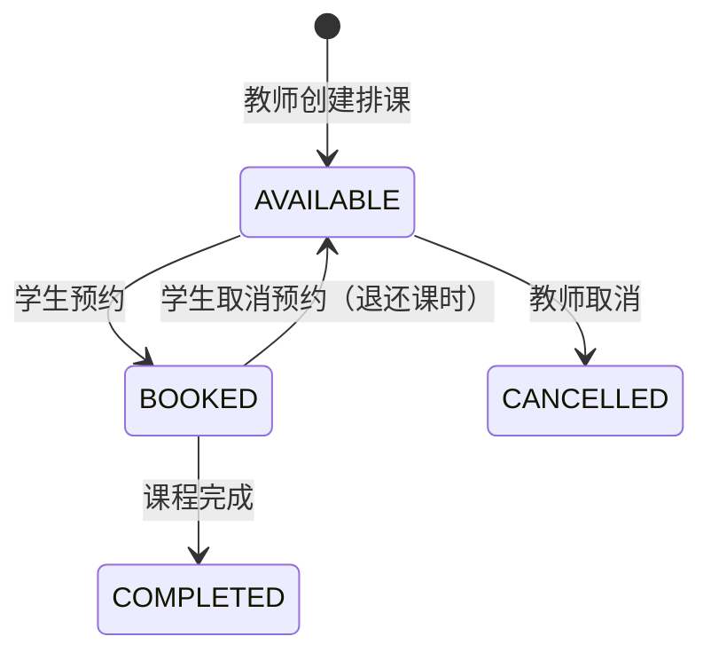

### 6.3 预约状态

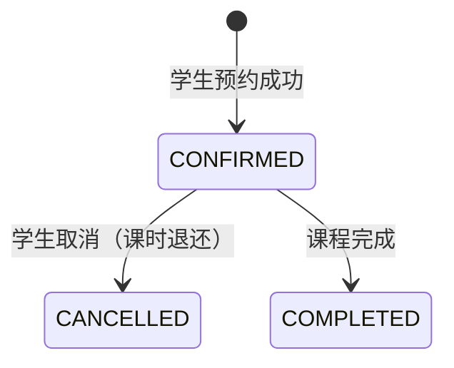

---

## 七、页面布局说明

### 7.1 整体布局结构

```
┌──────────────────────────────────────────────┐
│  Header: Logo + 用户名 + 角色标签 + 退出按钮   │
├──────────┬───────────────────────────────────┤
│          │                                   │
│  侧边栏  │           内容区域                 │
│  导航菜单│  （表格 / 表单 / 卡片）             │
│          │                                   │
│          │                                   │
└──────────┴───────────────────────────────────┘
```

### 7.2 教师端导航菜单

```
📚 我的课程
📅 课程安排
👥 学生管理
```

### 7.3 学生端导航菜单

```
🔍 浏览课程
⏱️ 我的课时
📆 课程预约
📋 我的预约
```

### 7.4 Modal 表单交互规范

| 交互 | 行为 |
|------|------|
| 点击"新增/编辑"按钮 | Modal 弹出，表单重置或填入已有数据 |
| 表单提交中 | 按钮显示 loading 状态，防止重复提交 |
| 提交成功 | Modal 关闭，列表自动刷新 |
| 提交失败 | Modal 保持打开，顶部显示错误信息 |
| 点击取消/蒙层 | Modal 关闭，数据不保存 |

---

## 八、错误处理交互

### 8.1 HTTP 错误码对应处理

| 状态码 | 场景 | 前端表现 |
|--------|------|----------|
| 400 | 参数错误（如课时不足） | Modal 内或页面顶部红色提示 |
| 401 | Token 失效/未登录 | 清除本地存储，跳转登录页 |
| 403 | 角色无权限 | 提示"无权访问"，跳转对应首页 |
| 500 | 服务器内部错误 | 提示"操作失败，请稍后重试" |

### 8.2 Token 过期处理流程

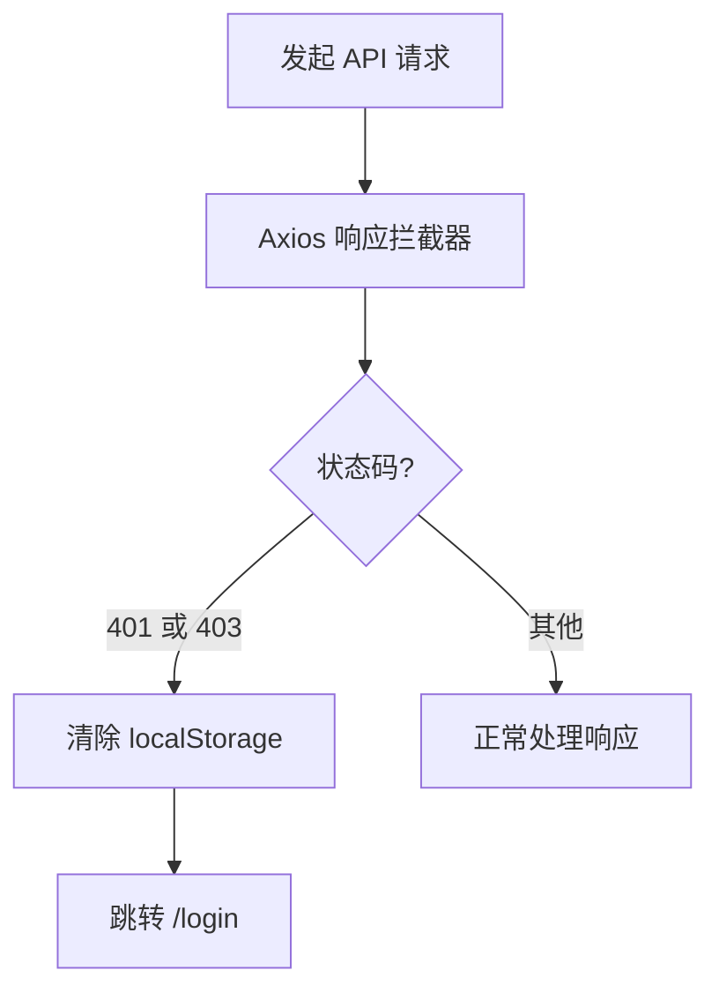

### 8.3 表单校验规则汇总

| 场景 | 校验规则 |
|------|----------|
| 注册用户名 | 不为空 |
| 注册密码 | 不为空 |
| 创建课程名称 | 不为空 |
| 课时单价 | 数字，≥ 0 |
| 排课时间 | 结束时间必须晚于开始时间 |
| 购买课时数 | 正整数，≥ 1 |

---

## 附录：技术栈

| 层级 | 技术 |
|------|------|
| 前端框架 | React 18 + TypeScript |
| UI 组件库 | Ant Design 5 |
| 路由 | React Router v6 |
| HTTP 客户端 | Axios |
| 后端框架 | Spring Boot 3 |
| 安全框架 | Spring Security + JWT |
| ORM | MyBatis-Plus |
| 数据库 | MySQL 8.0 |
| 部署 | Docker Compose |

---

*本文档中的流程图使用 Mermaid 语法绘制，可在 GitHub 直接渲染查看。*
